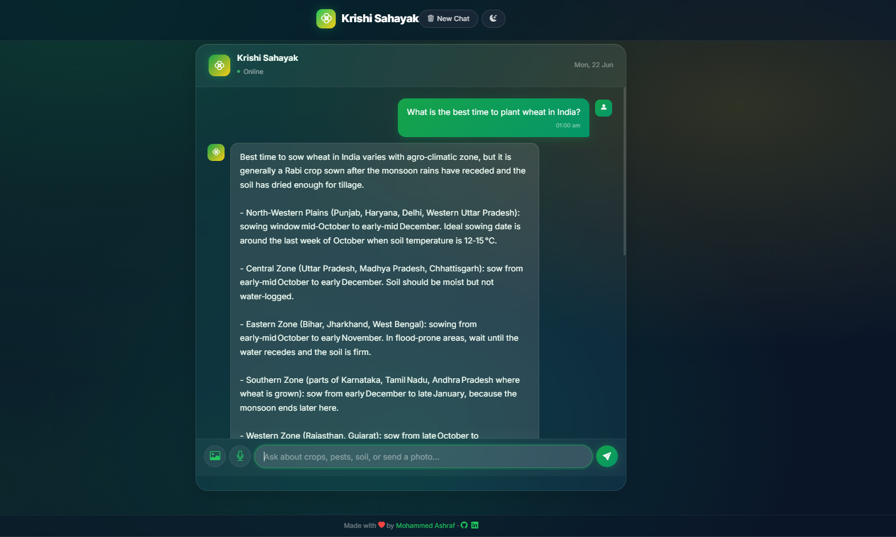
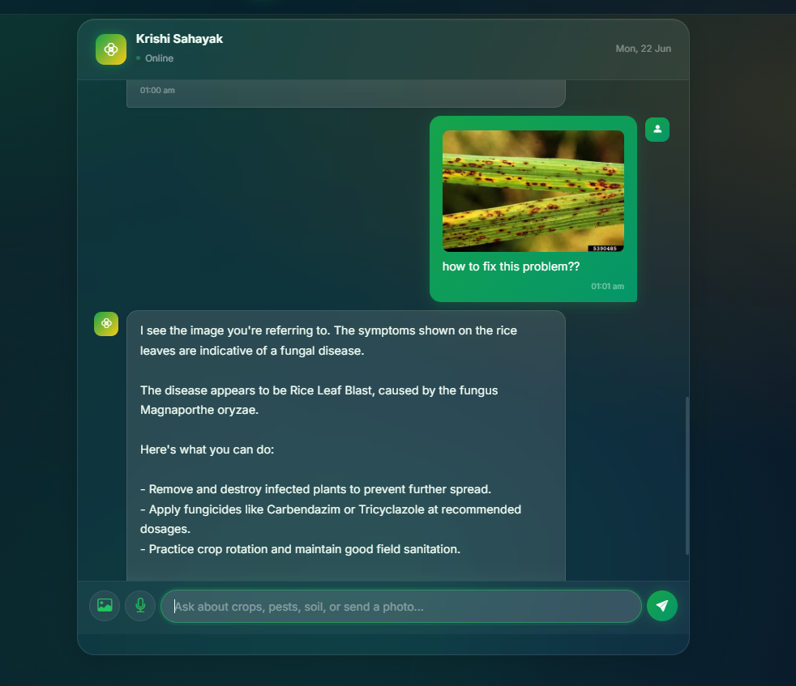

<div align="center">

# Krishi Sahayak

### AI Agriculture Assistant for Indian Farmers

[](https://python.org)
[](https://flask.palletsprojects.com)
[](https://console.groq.com)
[](LICENSE)
[](https://llm-agri-bot.onrender.com)
[](https://docs.astral.sh/uv/)

**Live Demo → [llm-agri-bot.onrender.com](https://llm-agri-bot-epj4.onrender.com/)**

An AI-powered agriculture chatbot that helps Indian farmers with crop advice, pest control, soil health, weather, and government schemes — using text, voice, and image analysis.

<br/>



</div>

---

## Features

| Feature | Description |
|---------|-------------|
| Text Chat | Ask any agriculture question and get expert answers |
| Image Diagnosis | Upload a crop photo → AI identifies diseases, pests & deficiencies |
| Voice Input | Speak in English, Hindi, or Hinglish via Groq Whisper |
| Voice Output | Bot reads answers aloud using Groq Orpheus TTS |
| Conversation Memory | Remembers your chat context (Redis, with in-memory fallback) |
| Prompt Caching | 50% cost savings — cached prefixes across requests |
| Dark/Light Theme | Glassmorphism UI with one-click theme toggle |
| Multilingual | Responds in English, Hindi, or Hinglish |



---

## Tech Stack

<table>
<tr>
<td><strong>Backend</strong></td>
<td>Python 3.11+, Flask, Groq SDK</td>
</tr>
<tr>
<td><strong>Frontend</strong></td>
<td>HTML5, CSS3 (Glassmorphism), jQuery</td>
</tr>
<tr>
<td><strong>LLM</strong></td>
<td><code>openai/gpt-oss-120b</code> (text), <code>meta-llama/llama-4-scout-17b-16e-instruct</code> (vision)</td>
</tr>
<tr>
<td><strong>Speech</strong></td>
<td>Groq Whisper <code>whisper-large-v3-turbo</code> (STT), Groq Orpheus <code>canopylabs/orpheus-v1-english</code> (TTS)</td>
</tr>
<tr>
<td><strong>Memory</strong></td>
<td>Redis (with automatic in-memory fallback)</td>
</tr>
<tr>
<td><strong>Deploy</strong></td>
<td>Render, Docker, Gunicorn</td>
</tr>
</table>

---

## Quick Start

### Prerequisites

- **Python 3.11+**
- **[uv](https://docs.astral.sh/uv/getting-started/installation/)** package manager
- **[Groq API key](https://console.groq.com/keys)** (free tier available)

### 1. Clone & Install

```bash
git clone 
cd LLM_Agri_Bot
uv sync
```

### 2. Configure

```bash
cp .env.example LLM_Agri_Bot/.env
```

Edit `LLM_Agri_Bot/.env` and add your Groq API key:

```env
GROQ_API_KEY=gsk_your_key_here
```

### 3. Run

```bash
uv run python LLM_Agri_Bot/run.py
```

Open **[http://127.0.0.1:5000](http://127.0.0.1:5000)**

---

## Environment Variables

Copy `.env.example` to `LLM_Agri_Bot/.env` and configure:

| Variable | Required | Default | Description |
|----------|:--------:|---------|-------------|
| `GROQ_API_KEY` | Yes | — | Your Groq API key ([get one](https://console.groq.com/keys)) |
| `LLM_MODEL` | No | `openai/gpt-oss-120b` | Text LLM model |
| `LLM_VISION_MODEL` | No | `meta-llama/llama-4-scout-17b-16e-instruct` | Vision LLM model |
| `LLM_TEMPERATURE` | No | `0.3` | Model temperature (0–2) |
| `LLM_MAX_TOKENS` | No | `2048` | Max response tokens |
| `STT_MODEL` | No | `whisper-large-v3-turbo` | Speech-to-text model |
| `TTS_MODEL` | No | `canopylabs/orpheus-v1-english` | Text-to-speech model |
| `TTS_VOICE` | No | `autumn` | TTS voice name |
| `REDIS_HOST` | No | `localhost` | Redis host (optional — falls back to memory) |
| `REDIS_PORT` | No | `6379` | Redis port |
| `REDIS_SSL` | No | `false` | Enable Redis SSL |
| `FLASK_SECRET_KEY` | Yes* | `dev-secret-key` | Flask session secret (*required in production) |
| `FLASK_DEBUG` | No | `true` | Enable debug mode |

---

## Project Structure

```
LLM_Agri_Bot/
├── app/
│   ├── __init__.py             # App factory (create_app)
│   ├── config.py               # Environment-based configuration
│   ├── routes/
│   │   ├── main.py             # Index page, robots.txt, sitemap, llms.txt
│   │   └── chat.py             # Chat API (text, voice, image)
│   ├── services/
│   │   ├── llm_service.py      # Groq LLM + vision + prompt caching
│   │   ├── memory_service.py   # Redis + in-memory fallback
│   │   ├── stt_service.py      # Groq Whisper STT
│   │   ├── tts_service.py      # Groq Orpheus TTS
│   │   └── prompt_manager.py   # XML + CoT system prompt
│   ├── static/
│   │   ├── css/style.css       # Glassmorphism UI (dark/light)
│   │   ├── js/chat.js          # Chat logic, image upload, voice
│   │   └── images/             # Favicon
│   └── templates/
│       └── index.html          # Main template (SEO + JSON-LD)
├── Sample_image/               # Screenshots for README
├── llms.txt                    # AI crawler disclosure
├── .env.example                # Environment template
├── gunicorn.conf.py            # Production Gunicorn config
├── Dockerfile                  # Docker deployment
├── render.yaml                 # Render blueprint
├── run.py                      # Dev entry point
├── pyproject.toml              # uv / project config
└── requirements.txt            # pip fallback
```

---

## Deployment

### Render (Recommended)

1. Push your code to GitHub
2. Go to [render.com](https://render.com) → **New** → **Web Service**
3. Connect your GitHub repo
4. Render auto-detects `render.yaml` and `Dockerfile`
5. Add your `GROQ_API_KEY` (and other env vars) in the Render dashboard
6. Click **Deploy**

### Docker

```bash
docker build -t krishi-sahayak .
docker run -p 10000:10000 --env-file LLM_Agri_Bot/.env krishi-sahayak
```

---

## API Reference

| Method | Endpoint | Description |
|--------|----------|-------------|
| `GET` | `/` | Chat interface |
| `POST` | `/chat` | Send text, image, or audio — returns AI response |
| `POST` | `/chat/clear` | Clear conversation history |
| `GET` | `/health` | Health check (Redis status) |
| `GET` | `/robots.txt` | Search engine crawl rules |
| `GET` | `/sitemap.xml` | XML sitemap |
| `GET` | `/llms.txt` | AI crawler disclosure |
| `GET` | `/.well-known/llms.txt` | AI crawler disclosure (well-known path) |

---

## How It Works

```
User sends message (text / image / voice)
        │
        ▼
┌─────────────────────────────────────────┐
│  Flask Backend                          │
│  ├── Text? → Groq LLM (gpt-oss-120b)  │
│  ├── Image? → Llama 4 Scout (vision)   │
│  └── Voice? → Whisper STT → LLM → TTS  │
│                                         │
│  Memory: Redis (or in-memory fallback)  │
│  Cache:  Groq automatic prompt caching  │
└─────────────────────────────────────────┘
        │
        ▼
Response with text + optional voice audio
```

---

## Contributing

Contributions welcome! See [CONTRIBUTING.md](CONTRIBUTING.md).

```bash
git checkout -b feature/your-feature
uv sync
# make changes
git commit -m "Add your feature"
git push origin feature/your-feature
```

---

## License

MIT License — see [LICENSE](LICENSE)

---

<div align="center">

**Built with care for Indian farmers**


</div>
